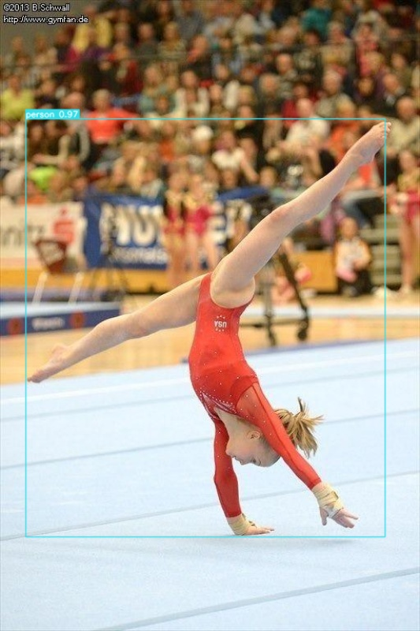

An unofficial wrapper of the [yolov7](https://github.com/WongKinYiu/yolov7.git) project.

It is very simple, and has only one function: `calculateDetections()`. 
Currently it only supports images, on CPU.

## Installation

The package is hosted on test.pypi.org, so you need to add the extra index url to your pip install command.
This is because it pulls the YOLOv7Detector from test.pypi, but the dependencies are hosted on pypi.org, so we get
them from there.

```bash
pip install -i https://test.pypi.org/simple/ --extra-index-url https://pypi.org/simple/ YOLOv7Detector==0.0.3
```

## Usage
You must download a model from the [YOLOv7](https://github.com/WongKinYiu/yolov7?tab=readme-ov-file#performance) page, 
and place it in the root directory of this project. Then you can use the following code to run inference on an image:
```python
from YOLOv7Detector import Detector as det
from PIL import Image


def main():
    # Initialize the YOLO inference object
    detector = det(weights_path='yolov7.pt', conf_thres=0.7, iou_thres=0.45, img_size=640)

    # Load the image
    image = Image.open('test_images/test_4.jpg')

    download_path = 'test_images/test_4_result.jpg'  # Leave as None if not needed

    dets = detector.calculateDetections(image, view_img=True, download_path=download_path)

    print(dets)


if __name__ == '__main__':
    main()

```

This returns a list of dictionaries, each dictionary is formatted as follows:
```python

{
    'class': 'person', 
    'confidence': 0.966009259223938, 
    'bbox': [31.0, 144.0, 469.0, 653.0]
}
```

where `bbox` is a list of `[x1, y1, x2, y2]` coordinates of the bounding box.
With view_img=True, the image with bounding boxes will be displayed as such:

